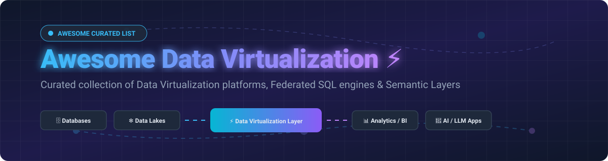

# ⚡ Awesome Data Virtualization

  

  
  
  
  
  

> 🚀 **Curated Ecosystem of Enterprise Data Virtualization Platforms, Distributed Federated SQL Query Engines & Semantic Layers**
> 
> *A comprehensive guide for data engineers, analytics architects, and platform leads to query across disparate databases, data lakes, and SaaS applications in real time without ETL data movement.*

---

## 📚 Table of Contents
- [🌐 Market Overview & Insights](#-market-overview--insights)
- [🏢 SaaS & Hosted Platforms](#-saas--hosted-platforms)
- [🔓 Open-Source GitHub Projects](#-open-source-github-projects)
- [📈 Star History](#-star-history)
- [🤝 How to Contribute](#-how-to-contribute)
- [💖 Support & Sponsorship](#-support--sponsorship)
- [⚠️ Disclaimer](#%EF%B8%8F-disclaimer)

---

## 🌐 Market Overview & Insights

> 💡 **Market Size & Structure**: The global Data Virtualization market is estimated at **$4.8 Billion (2025–2026)** and is projected to reach **$12.5 Billion+ by 2030** with a rapid **CAGR of ~16.5%**. 
> 
> The sector is **moderately fragmented**: While cloud infrastructure query execution is heavily influenced by major hyperscalers, the specialized data virtualization, semantic layer, and logical data fabric layer feature intense competition between enterprise incumbents (Denodo, IBM, TIBCO) and modern cloud-native platforms (Dremio, Starburst, CData).

---

## 🏢 SaaS & Hosted Platforms

The table below lists top enterprise data virtualization platforms sorted by company scale (Revenue / Valuation):

| Platform | Description | Pricing / Starting Tier | Free Tier / Free Trial Limits | Scale (Revenue / Valuation) |
| :--- | :--- | :--- | :--- | :--- |
| **[IBM Cloud Pak for Data](https://www.ibm.com/)** 🏢 | Hybrid cloud data & AI platform with built-in Enterprise Data Virtualization engine across multi-cloud stores. | From **$1,000 / month** (pay-as-you-go capacity units) | **30-day Free Trial** (IBM Cloud Lite tier with 10,000 free processing credits) | **~$62 Billion** Annual Revenue |
| **[TIBCO Data Virtualization](https://www.tibco.com/)** 🏛️ | Enterprise data virtualization platform for unified real-time data access across heterogeneous data sources. | From **$2,500 / month** (estimated core subscription) | **30-day Free Trial** (Available via sales/partner environment evaluation) | **~$17 Billion** Parent Valuation (Cloud Software Group merger) |
| **[Starburst](https://www.starburst.io/)** 🚀 | Enterprise federated SQL platform built on Trino with Warp Speed query acceleration and enterprise security. | From **$0.50 / credit** (~$500/mo base usage) | **$500 Free Credits** on Starburst Galaxy (valid for 30 days) | **~$1.2 Billion** Valuation |
| **[CData Virtuality](https://www.cdata.com/)** 🔌 | Enterprise data virtualization & real-time integration suite delivering unified SQL views for 200+ sources. | From **$499 / month** (Standard Cloud instance) | **30-day Free Trial** (Full featured platform access) | **~$800 Million** Valuation |
| **[Dremio](https://www.dremio.com/)** ❄️ | Cloud-native lakehouse & zero-ETL data virtualization platform with Apache Arrow Reflections acceleration. | From **$0.20 / Dremio credit** ($400/mo minimum) | **Free Forever Community Edition** (Self-managed deployment) / **$400 Free Cloud Credits** | **~$1.0 Billion** Valuation |
| **[Denodo](https://www.denodo.com/)** 👑 | Market leader in logical data warehouse and data fabric virtualization across 200+ enterprise connectors. | From **$6.27 / hour** (Azure/AWS Marketplace instance) | **Free Forever Developer Tier** (Single developer workspace) & **30-day Free Trial** | **~$300 Million** Annual Revenue |
| **[AtScale](https://www.atscale.com/)** 📊 | Enterprise semantic layer & virtual OLAP cube engine providing dynamic aggregate awareness and SQL/MDX access. | From **$2,500 / month** ($10-$28 per deployed semantic object) | **14-day Free Trial** (Interactive sandbox environment) | **~$100 Million** Valuation |

---

## 🔓 Open-Source GitHub Projects

Curated open-source query engines, federated SQL frameworks, and semantic layer engines sorted by GitHub_Stars:

| Project | Description | GitHub_Stars | License |
| :--- | :--- | :--- | :--- |
| 🦆 **[DuckDB](https://github.com/duckdb/duckdb)** | In-process analytical SQL database engine optimized for fast local compute, zero-copy querying, and cross-engine data federation. |  | MIT |
| 🧊 **[Cube Core](https://github.com/cube-js/cube)** | Headless BI and semantic layer platform exposing unified data models over REST, GraphQL, and SQL Postgres wire protocols. |  | Apache-2.0 / MIT |
| 🚀 **[Presto](https://github.com/prestodb/presto)** | Distributed SQL query engine for big data and federated analytics across multi-cloud data lakes and warehouses. |  | Apache-2.0 |
| ⚡ **[Trino](https://github.com/trinodb/trino)** | De facto standard open-source distributed SQL query engine for high-performance data virtualization and federation. |  | Apache-2.0 |
| 🔥 **[Apache DataFusion](https://github.com/apache/datafusion)** | Extensible Rust-based in-memory query engine substrate designed for building custom data virtualization and SQL federators. |  | Apache-2.0 |
| 💎 **[Apache Calcite](https://github.com/apache/calcite)** | Dynamic data management framework providing query optimization, SQL parsing, and relational algebra planning foundation. |  | Apache-2.0 |
| 🌐 **[Apache DataFusion Ballista](https://github.com/apache/datafusion-ballista)** | Distributed compute platform built on Apache DataFusion and Rust for federated SQL query execution over data nodes. |  | Apache-2.0 |
| 🛠️ **[Apache Drill](https://github.com/apache/drill)** | Schema-free SQL query engine for big data enabling real-time ad-hoc federation across NoSQL databases and file systems. |  | Apache-2.0 |
| 🕸️ **[Ontop](https://github.com/ontop/ontop)** | Virtual Knowledge Graph (VKG) engine reformulating SPARQL queries into virtual SQL views over relational data sources. |  | Apache-2.0 |
| 🧬 **[Teiid](https://github.com/teiid/teiid)** | Enterprise data virtualization system providing heterogeneous data store abstraction and unified relational access. |  | Apache-2.0 |
| 🌌 **[OrionBelt Semantic Layer](https://github.com/ralforion/orionbelt-semantic-layer)** | Semantic layer engine compiling YAML models into optimized SQL across 8 engines via Arrow Flight SQL and Postgres wire. |  | BSL-1.1 |
| 🔀 **[DVT (Data Virtualization Tool)](https://github.com/dvt-io/dvt-core)** | Cross-engine dbt transformation framework enabling SQL models to join tables residing on separate database engines using DuckDB compute. |  | MIT |

---

## 📈 Star History

---

## 🤝 How to Contribute

Contributions are welcome! Please follow these simple guidelines:

1. 🍴 **Fork the Repository**
2. 📝 **Add or Update Entries**: Maintain factual descriptions, official documentation links, and proper formatting.
3. 🔬 **Verify Links & Licensing**: Ensure all open-source repositories and SaaS URLs are valid.
4. 📬 **Submit a Pull Request**: Provide a brief explanation of your additions or edits.

---

## 💖 Support & Sponsorship

If you find this curated list valuable for your data engineering work or platform evaluations:

- ⭐ **Star this repository** to show support!
- 🔀 **Fork it** to customize your own evaluation matrix.
- 📣 **Share it** with fellow data architects and platform engineers.
- ☕ **Buy me a coffee**: If you'd like to sponsor the maintenance of this repository, consider supporting via [GitHub Sponsors](https://github.com/sponsors/ishandutta2007).

---

## ⚠️ Disclaimer

- This is a **community-curated list** intended for educational and informational purposes — not an official endorsement.
- Data Virtualization platforms handle sensitive enterprise infrastructure; always enforce strict data governance, access controls, and encryption standards.
- Market valuations, Stars_Counts, and pricing models are subject to vendor adjustments and community updates.
